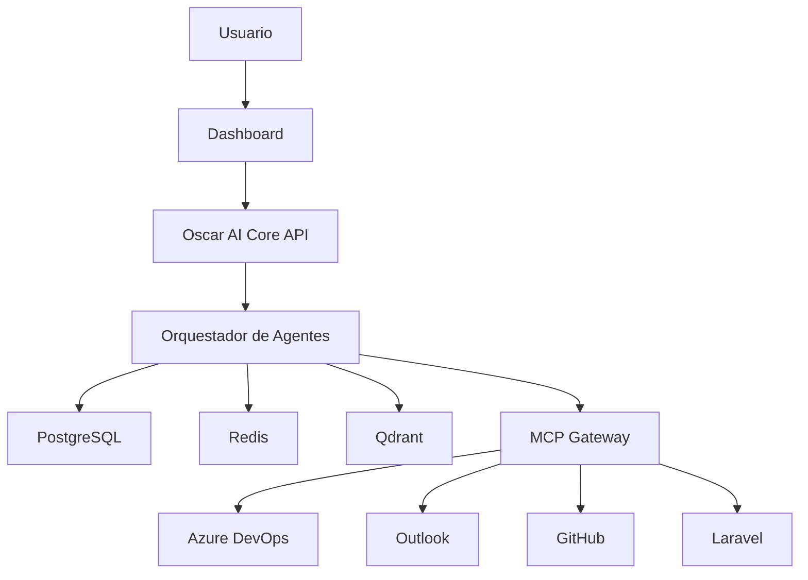

# Architecture

## Resumen

Oscar AI adopta una arquitectura modular basada en contenedores, agentes especializados y almacenamiento diferenciado por tipo de información. La solución se organiza alrededor de cuatro capas:

1. Interfaz y consumo: dashboard, API y webhooks.
2. Orquestación: core, agentes, reglas, permisos y flujos.
3. Datos e inteligencia: PostgreSQL, Redis, Qdrant y memoria de trabajo.
4. Integraciones: MCP, APIs nativas y conectores externos.

## Principios arquitectónicos

- Docker first.
- API first.
- Security first.
- Memory first.
- Modularidad por dominio.
- Trazabilidad por diseño.

## Vista lógica

## Decisiones de diseño

- PostgreSQL almacena entidades estructuradas y auditoría.
- Qdrant almacena embeddings y fragmentos semánticos.
- Redis soporta caché, colas cortas y sesiones.
- Un orquestador coordina agentes especializados en lugar de un monolito conversacional único.

## Referencias

- [TechnologyStack.md](TechnologyStack.md)
- [Deployment.md](Deployment.md)
- [Security.md](Security.md)
- [../03-c4/Context.md](../03-c4/Context.md)
- [../03-c4/Sequence.md](../03-c4/Sequence.md)
- [../03-c4/State.md](../03-c4/State.md)

