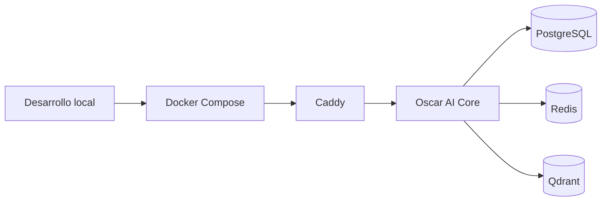

# Deployment

## Estrategia de despliegue

La estrategia inicial de despliegue se basa en contenedores Docker y Docker Compose. Esto permite reproducibilidad local, aislamiento de dependencias y una transición ordenada a entornos superiores.

## Consideraciones operativas

- Los secretos no deben almacenarse en el repositorio.
- Las configuraciones deben inyectarse por variables de entorno o secret stores.
- Los servicios con estado necesitan volúmenes persistentes y backup.
- Caddy centraliza el acceso HTTP/HTTPS.

## Evolución futura

Si la carga, disponibilidad o multientorno lo requiere, la documentación deberá evolucionar hacia:

- despliegue por entorno con Compose separado;
- integración con registry de imágenes;
- orquestación avanzada con Kubernetes;
- hardening de red y políticas de acceso.

## Referencias

- [../10-devops/Docker.md](../10-devops/Docker.md)
- [../10-devops/DockerCompose.md](../10-devops/DockerCompose.md)
- [../10-devops/Backup.md](../10-devops/Backup.md)
