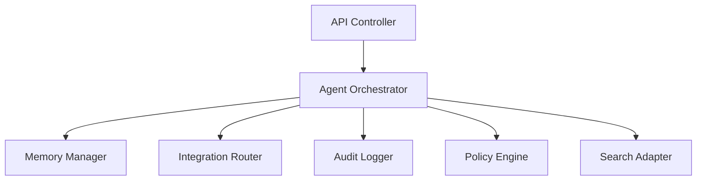

# C4 Component

## Componentes del core

- API Controller: expone operaciones internas y externas.
- Agent Orchestrator: decide qué agente ejecutar y con qué contexto.
- Memory Manager: gestiona memoria de trabajo, persistencia y recuperación.
- Integration Router: selecciona MCP o API nativa.
- Audit Logger: registra eventos relevantes.
- Policy Engine: aplica permisos, límites y reglas operativas.
- Search Adapter: traduce consultas a recuperación semántica.

## Responsabilidades

| Componente | Entrada | Salida |
| --- | --- | --- |
| API Controller | Solicitudes HTTP o internas | Respuestas y comandos |
| Agent Orchestrator | Intención, contexto y reglas | Trabajo distribuido |
| Memory Manager | Datos de trabajo y referencias | Contexto consolidado |
| Integration Router | Peticiones a sistemas externos | Llamadas MCP o API |
| Audit Logger | Eventos y cambios | Trazabilidad |
| Policy Engine | Contexto y reglas | Decisión permitida o denegada |
| Search Adapter | Query semántica | Fragmentos relevantes |

