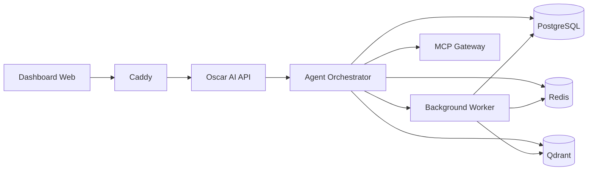

# C4 Container

El contenedor lógico de la solución separa presentación, API, orquestación, procesamiento asíncrono, persistencia y gateways de integración.

## Responsabilidades por contenedor

| Contenedor | Rol | Persistencia |
| --- | --- | --- |
| Dashboard Web | Interfaz para usuarios y supervisión | No |
| Oscar AI API | Exposición de operaciones y contratos | No |
| Agent Orchestrator | Decide, coordina y consolida | Estado temporal |
| Background Worker | Procesa tareas diferidas y sincronizaciones | Estado temporal |
| PostgreSQL | Fuente de verdad estructurada | Sí |
| Redis | Caché, colas y coordinación temporal | Sí, efímera |
| Qdrant | Recuperación semántica | Sí |
| MCP Gateway | Conector a herramientas externas | No |

