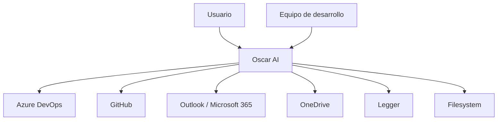

# C4 Context

Oscar AI se sitúa entre la persona usuaria y los sistemas corporativos o personales que contienen tareas, documentos, correo, historial y evidencia operativa.

## Actores

| Actor | Responsabilidad | Interés |
| --- | --- | --- |
| Usuario | Consume, consulta y valida resultados | Productividad y trazabilidad |
| Equipo de desarrollo | Mantiene plataforma, contrato y extensiones | Evolución estable |
| Sistemas externos | Exponen datos o capacidades | Integración segura |

## Intercambios principales

- El usuario envía solicitudes, contexto o material para análisis.
- Oscar AI recupera conocimiento y coordina agentes para producir una respuesta.
- Los sistemas externos aportan evidencia, estado o documentos.
- El repositorio documental mantiene la arquitectura y las decisiones.

## Fronteras de confianza

- La frontera de usuario separa inputs interactivos de automatizaciones.
- La frontera de integración separa Oscar AI de sistemas de terceros.
- La frontera de persistencia separa el conocimiento curado de la memoria de trabajo.

