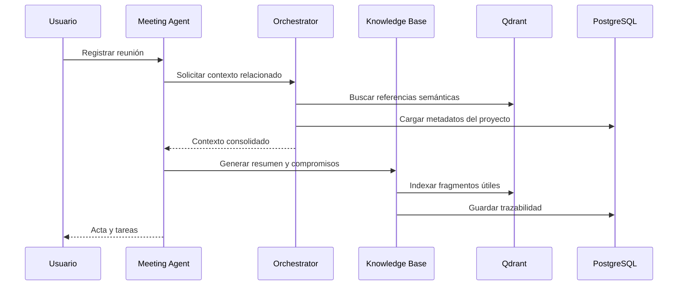
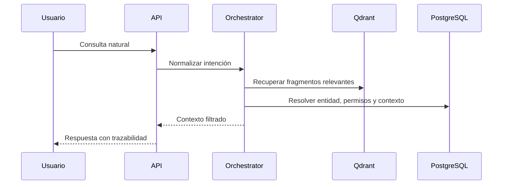

# Sequence

## Secuencia principal: de reunión a conocimiento

```mermaid
sequenceDiagram
    participant U as Usuario
    participant M as Meeting Agent
    participant O as Orchestrator
    participant KB as Knowledge Base
    participant Q as Qdrant
    participant P as PostgreSQL

    U->>M: Registrar reunión
    M->>O: Solicitar contexto relacionado
    O->>Q: Buscar referencias semánticas
    O->>P: Cargar metadatos del proyecto
    O-->>M: Contexto consolidado
    M->>KB: Generar resumen y compromisos
    KB->>Q: Indexar fragmentos útiles
    KB->>P: Guardar trazabilidad
    M-->>U: Acta y tareas
```

## Secuencia de recuperación semántica

```mermaid
sequenceDiagram
    participant U as Usuario
    participant A as API
    participant O as Orchestrator
    participant Q as Qdrant
    participant P as PostgreSQL

    U->>A: Consulta natural
    A->>O: Normalizar intención
    O->>Q: Recuperar fragmentos relevantes
    O->>P: Resolver entidad, permisos y contexto
    O-->>A: Contexto filtrado
    A-->>U: Respuesta con trazabilidad
```
