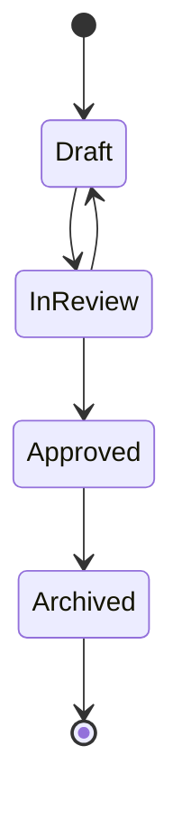
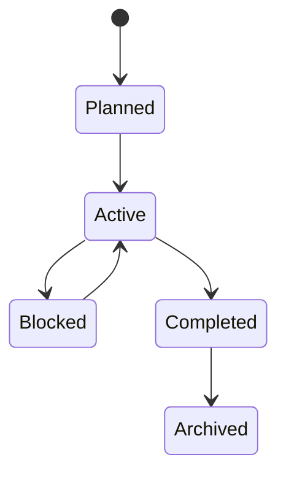
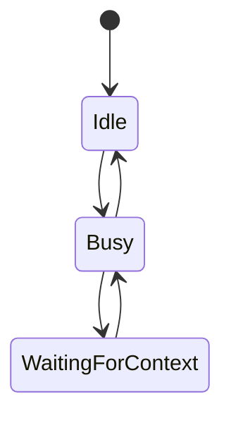

# State

## Estado de un documento

```mermaid
stateDiagram-v2
    [*] --> Draft
    Draft --> InReview
    InReview --> Approved
    InReview --> Draft
    Approved --> Archived
    Archived --> [*]
```

## Estado de un proyecto

```mermaid
stateDiagram-v2
    [*] --> Planned
    Planned --> Active
    Active --> Blocked
    Blocked --> Active
    Active --> Completed
    Completed --> Archived
```

## Estado de un agente

```mermaid
stateDiagram-v2
    [*] --> Idle
    Idle --> Busy
    Busy --> WaitingForContext
    WaitingForContext --> Busy
    Busy --> Idle
```
