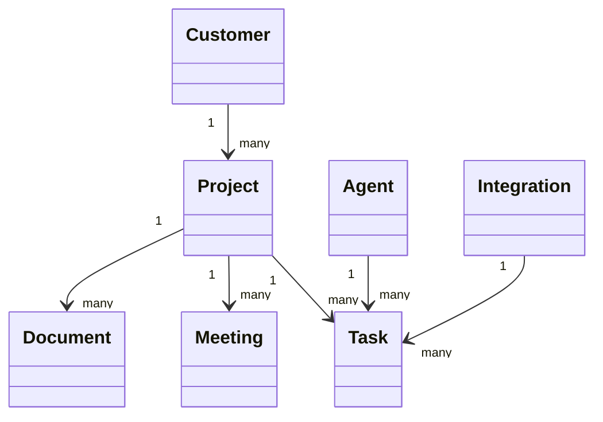

# Domain Model

## Núcleo del dominio

Oscar AI se organiza alrededor de cinco conceptos principales:

- Customer: entidad cliente o cuenta.
- Project: contenedor de trabajo, seguimiento y contexto.
- Document: artefacto versionable y recuperable.
- Meeting: evento que produce acuerdos y tareas.
- Agent: unidad especializada de ejecución.

## Relaciones

## Reglas de dominio

- Un proyecto pertenece a un cliente.
- Un documento puede tener múltiples versiones, pero una sola versión activa.
- Una reunión puede generar tareas, decisiones y material de conocimiento.
- Una tarea puede ser ejecutada o enriquecida por uno o más agentes.
