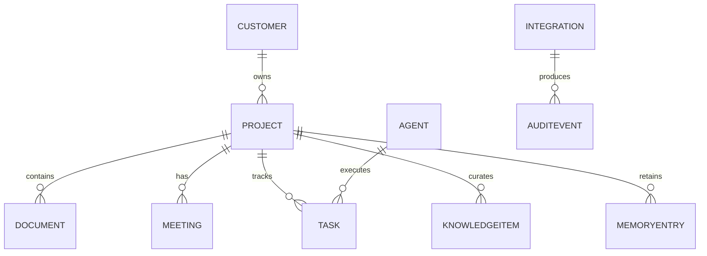

# ERD

## Entidades principales

- Customer
- Project
- Document
- Meeting
- Agent
- Integration
- Task
- AuditEvent
- KnowledgeItem
- MemoryEntry

## Notas

- KnowledgeItem representa conocimiento curado para RAG o documentación.
- MemoryEntry representa elementos de memoria persistente o contextual.

