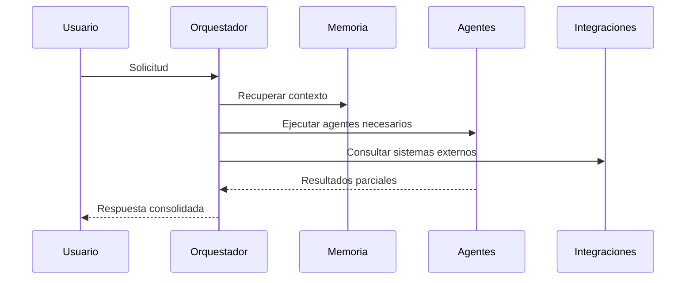

# Agent Orchestrator

## Rol

El orquestador decide qué agente o combinación de agentes debe intervenir ante una solicitud, ordena contexto, aplica reglas y consolida el resultado.

## Responsabilidades

- Clasificar la intención.
- Recuperar contexto relevante.
- Distribuir tareas entre agentes.
- Consolidar resultados.
- Registrar decisiones y trazabilidad.

## Relación con el contrato común

El orquestador consume el contrato descrito en [Agent-Contracts.md](Agent-Contracts.md) para enrutar agentes con una estructura homogénea de propósito, entradas, salidas y límites.

## Flujo de alto nivel

## Reglas de enrutamiento

- Solicitudes de estado y planificación deben priorizar PM Agent.
- Solicitudes de calidad, validación o regresión deben priorizar QA Agent.
- Solicitudes de actas, resúmenes y conocimiento deben priorizar Documentation Agent o Meeting Agent según la fuente.
- Solicitudes de correo y comunicación deben priorizar Communication Agent.
- Solicitudes del ecosistema Legger deben priorizar Legger Agent.
- Las tareas compuestas pueden activar más de un agente, pero el orquestador conserva la decisión final.

