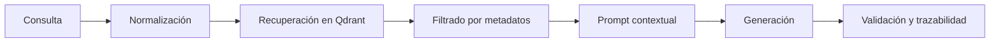

# RAG

## Objetivo

Combinar recuperación semántica y generación para responder con contexto real y no solo con inferencia genérica.

## Pipeline lógico

## Buenas prácticas

- Recuperar poco pero relevante.
- Priorizar fuentes curadas.
- Incluir referencias al origen.
- Evitar que la respuesta oculte incertidumbre.

## Estado actual en Oscar AI

- Qdrant se organiza en dos colecciones independientes: `meetings` (para actas y resúmenes de reuniones) y `documents` (para guías, especificaciones y documentación de proyectos).
- La búsqueda semántica está implementada en `/api/v1/search?q=...` y admite búsquedas cruzadas y filtradas usando el parámetro `type=all|meetings|documents`.
- Soporte multiproveedor para **Embeddings Densos Reales** configurable mediante variables de entorno (`EMBEDDING_PROVIDER`):
  - **Google Gemini**: Modelo `text-embedding-004` (768 dimensiones).
  - **OpenAI**: Modelo `text-embedding-3-small` (1536 dimensiones).
  - **Ollama**: Modelo `nomic-embed-text` o `all-minilm` (768 / 384 dimensiones).
  - **Hash Fallback**: Vectorizador determinista ligero (32 dimensiones) para pruebas 100% locales sin llaves de API externas.
- Redimensionamiento y recreación automática de colecciones en Qdrant cuando cambia el proveedor de vectores activo.

