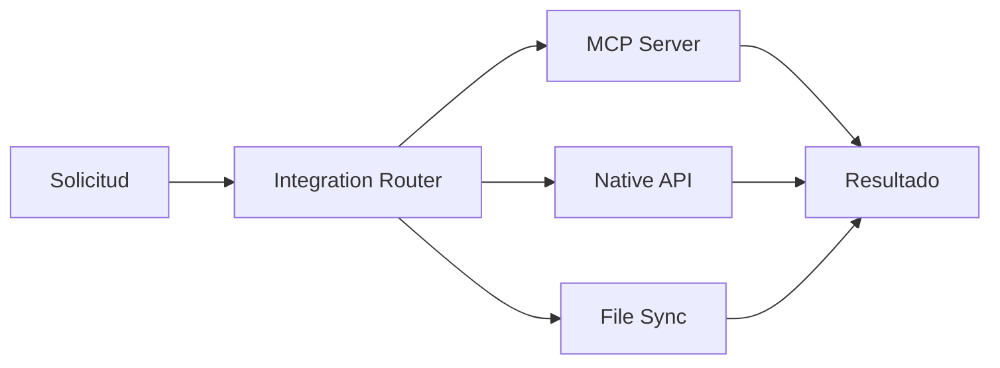

# Integration Strategy

## Objetivo

Definir una forma homogénea de integrar Oscar AI con sistemas externos sin fragmentar la plataforma en conectores ad hoc.

## Jerarquía de integración

1. MCP cuando exista servidor compatible.
2. API nativa cuando el sistema no tenga MCP.
3. Importación o sincronización por archivos cuando no haya API ni MCP.

## Principios

- Una integración debe tener dueño funcional.
- Los secretos se gestionan fuera del repositorio.
- Cada integración debe registrar errores y auditoría.
- La estrategia de reintentos y límites debe documentarse.

## Flujo estándar

