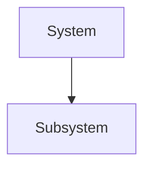

# Architecture Template

## Purpose

Describe the architecture area and what it covers.

## Scope

- In scope
- Out of scope

## Key principles

- Principle 1
- Principle 2

## Logical view

## Decisions

- Decision 1
- Decision 2

## Risks

- Risk 1
- Risk 2

## References

- ADRs
- C4 models
